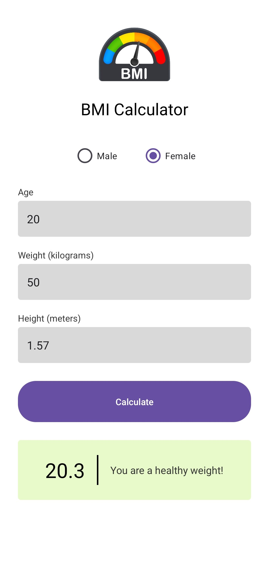

# BMI Calculator 📱

A clean, modern Android application built in **Java** that calculates Body Mass Index (BMI) based on user inputs for weight and height. It provides real-time health status feedback with a beautiful user interface.

---

## 📸 Screenshots

Here is the design layout and live preview of the app:

| App Interface                                                              |
|----------------------------------------------------------------------------|
|  |

---

## ✨ Features
* **Gender Selection:** Easily toggle between Male and Female options.
* **Smart Inputs:** Age, Weight (in kg), and Height (in meters) text fields with tailored numeric keyboards.
* **Instant Calculation:** Calculates your exact BMI score instantly upon clicking the button.
* **Visual Status Box:** Displays a color-coded feedback panel showing your weight category (Underweight, Healthy, Overweight, or Obese).

---

## 🛠️ Built With
* **Language:** Java
* **IDE:** Android Studio
* **UI Layout:** XML (with custom rounded shapes and responsive layout constraints)
* **Version Control:** Git & GitHub